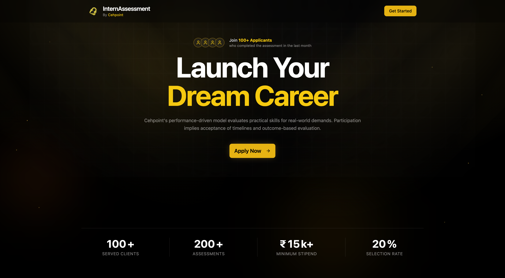

<div align="center">

# 🎓 InternLink — AI‑Powered Proctored Intern Assessment

**A single‑page web platform that turns intern hiring into a fair, AI‑personalised, fully‑proctored online interview — no installs, no plugins, just a browser.**

[](https://internlink.cehpoint.co.in)
[](https://react.dev)
[](https://www.typescriptlang.org)
[](https://vitejs.dev)
[](https://vercel.com)

### ✨ 200+ candidates have completed their assessment smoothly on this platform ✨

<br />



</div>

---

## 📖 What is this?

**InternLink** is the candidate-facing assessment portal used by **Cehpoint** to screen internship applicants at scale. A candidate lands on the page, uploads their résumé, and the system instantly generates **interview questions tailored to their own experience** using AI. They answer (by typing *or* voice) under a **browser-based proctoring layer** that records the session, watches the camera, and enforces exam integrity — then submit. Recruiters review everything in a separate admin portal ([it-portal](#-the-recruiter-side)).

> No candidate downloads anything. No browser extension. The entire proctored, AI-driven interview runs in a normal Chrome tab.

---

## 🌟 Why it stands out

<table>
<tr>
<td width="50%" valign="top">

### 👤 For Candidates
- **Zero setup** — works in any modern desktop browser
- **Personalised questions** generated from *your* résumé, not a generic bank
- **Type or speak** your answers (built-in speech-to-text)
- **Never lose your work** — recording is saved locally and a download fallback kicks in if the network fails mid-submit
- Clean, dark, distraction-free UI with smooth scrolling

</td>
<td width="50%" valign="top">

### 🧑‍💼 For Recruiters
- **Proctored video** of every session (screen + face + audio)
- **AI résumé analysis** + auto-generated, role-relevant questions
- **Integrity signals** — camera-off, tab-switch, screen-share-stop, multi-monitor, fullscreen-exit all enforced
- **One submission per candidate**, validated server-side
- Scales effortlessly — **200+ assessments processed**

</td>
</tr>
</table>

---

## 🧭 The candidate journey

The assessment runs as a **6-step guided modal**, with a progress stepper at the top:

```
 1️⃣ Personal Info  →  2️⃣ Questions  →  3️⃣ Permissions  →  4️⃣ Rules  →  5️⃣ Résumé + AI  →  6️⃣ Submit  →  ✅ Success
```

| Step | What happens |
|------|--------------|
| **1. Personal Info** | Name, email, phone, LinkedIn, stipend expectation, start date, weekly commitment, trial acceptance — validated with `zod`. |
| **2. Predefined Questions** | A short set of standard screening questions. |
| **3. Permissions** | Camera, microphone, screen-share & browser checks. The candidate *must* grant them to continue. |
| **4. Proctoring Rules** | The integrity rules are shown and must be accepted. |
| **5. Résumé Upload + AI** | Upload a PDF résumé → AI extracts skills/experience/education → generates **personalised interview questions**. **Screen recording + camera proctoring start here.** Candidate answers by typing or voice. |
| **6. Feedback & Submit** | Optional feedback, then submit. The recording uploads, the application is written to the database, and a success screen confirms. |

---

## 🛡️ The proctoring & integrity engine

Everything below is enforced **client-side in the browser** — the realistic ceiling for a no-install web exam:

| Control | Behaviour |
|---|---|
| 🎥 **Camera monitoring** | Live webcam shown on-screen (and captured in the recording). Camera turned off / unplugged / covered → **immediate termination**. |
| 🖥️ **Screen recording** | Full-screen capture via `getDisplayMedia`. Stopping the share → **immediate termination**. Window/tab shares are rejected — the candidate must share the *entire* screen. |
| 🎙️ **Audio monitoring** | Microphone required; muting/disabling it is flagged. |
| 🔳 **Fullscreen enforcement** | Exam runs fullscreen; exits are tracked. |
| 🪟 **Tab-switch / blur detection** | Leaving the tab is logged as a violation. |
| 🖥️🖥️ **Multi-screen detection** | Additional monitors are detected. |
| 🚫 **Copy / paste / right-click / DevTools** | Blocked / detected to deter external lookup. |
| ⏱️ **Grace period** | A short start-up grace window avoids false positives from permission dialogs. |

**Two violation classes:** critical events (camera-off, screen-share-stop, audio-off) **terminate immediately**; softer events (fullscreen exit, tab blur) use a strike model so legitimate browser prompts don't unfairly fail a candidate.

> 🔎 **Honest scope:** browser JavaScript can reliably detect a camera being *off, blocked, or stopped* — it **cannot** verify a real face is in frame, defeat a virtual camera, or see a phone next to the laptop. Those require a native proctoring app and are documented, accepted residual risks.

---

## 🎬 The recording pipeline (built for reliability)

Losing a candidate's proctoring video mid-submit is unacceptable — so the upload path is engineered defensively:

```
 MediaRecorder (screen + mic, 500 kbps, 5s chunks)
        │
        ├──▶ accumulates in memory ──▶ IndexedDB backup
        │
   on submit ▼
        │
   webm duration injected (fix-webm-duration)  ← makes the file seekable / full-length
        │
        ▼
   Chunked / resumable upload to Cloudinary (6 MB chunks, per-chunk retry)
        │
        ├── success ──▶ secure URL saved to the application record
        │
        └── network failure ──▶ video auto-downloaded to the candidate's device
                                 + answers still submitted (never blocks the candidate)
```

**Why each piece exists:**
- **Chunked / resumable upload** — a ~100 MB, 25-minute video uploads in 6 MB chunks; a failed chunk retries on its own instead of restarting the whole file. Reliable even on slow connections.
- **`fix-webm-duration`** — `MediaRecorder` timeslice blobs have no duration header, which makes a raw download appear "a few seconds long." We inject the real duration so downloads are full-length and seekable.
- **IndexedDB + local-download fallback** — if the upload genuinely can't complete, the candidate's answers still submit and the full video is saved to their device to email in.
- **25-minute cap** — recording auto-finalises at 25 minutes and is safely stored.

---

## 🤖 The AI pipeline

The résumé → questions flow runs on a **dual-backend architecture with automatic failover**, so a single provider outage never blocks a candidate:

```
            ┌───────────────────────────────────────────┐
            │  aiConfig/active  (Firestore, admin-set)   │
            │  provider: "gemini" | "openrouter"         │
            └───────────────┬───────────────────────────┘
                            │  read per request
        ┌───────────────────┴────────────────────┐
        ▼                                          ▼
  Vercel Function                            PHP Backend
  /api/analyzeResume.js                      internlink-api.cehpoint.co.in
  ⚡ Gemini (fast, ~15s)                      🐢 OpenRouter (no time limit)
  multi-key rotation + failover              model fallback chain
        └───────────────────┬────────────────────┘
                            ▼
        same contract → { resumeAnalysis, questions }
```

- The frontend reads the admin-selected provider and **routes to the right backend first, the other as fallback**.
- The Gemini path rotates across multiple API keys on quota / rate-limit errors before failing over.
- The admin can switch provider/model live (via the recruiter portal) — no redeploy needed.

---

## 🏗️ Tech stack

| Layer | Technology |
|---|---|
| **Framework** | React 19 + TypeScript 5.8, built with Vite 7 |
| **Styling** | Tailwind CSS v4 (CSS-var tokens), shadcn/ui (new-york), Framer Motion, Lenis smooth scroll |
| **State** | Zustand (`persist`-wrapped single store) |
| **Forms** | React Hook Form + Zod |
| **Data / Auth** | Firebase (Firestore, Storage, Auth) — client SDK + `firebase-admin` on the server |
| **Media** | `getDisplayMedia` / `getUserMedia` + `MediaRecorder`, Cloudinary (chunked upload), `fix-webm-duration`, IndexedDB |
| **Voice input** | `react-speech-recognition` |
| **AI** | Google Gemini (`@google/genai`) via Vercel function · OpenRouter via PHP backend |
| **Icons / Toasts** | lucide-react · sonner |
| **Hosting** | Vercel (SPA + serverless functions) |

---

## 📁 Project structure

```
api/                      Vercel serverless functions (plain JS)
  analyzeResume.js        Gemini résumé analysis + question generation (multi-key failover)
  signCloudinaryUpload.js Signed-upload helper (optional)
php-backend/              Standalone PHP service mirroring the AI contract (OpenRouter path)
src/
  App.tsx                 Providers (QueryClient → Recording → Proctoring → Router) + Lenis
  Firebase.ts             Firebase init (Storage, Firestore, Auth)
  pages/                  Route components (home, not-found)
  components/
    landing/              Marketing sections (Hero, FAQ, Reviews, Transparency, Footer…)
    steps/                The 6-step assessment modal (one file per step)
    ProctoringMonitor.tsx Live camera/audio monitor overlay
    ui/                   shadcn/ui primitives
  context/                RecordingContext (capture + chunked upload + IndexedDB)
                          ProctoringContext (global integrity state)
  hooks/                  useProctoring, useScreenRecording
  store/                  Zustand store (single source of truth, persisted)
  lib/                    queryClient, zod validation, aiProvider routing, debug logger, utils
  utils/                  browser/screen detection, speech-to-text, formatting
  types/                  shared application types
vercel.json               Function memory/duration + SPA rewrites
```

---

## 🚀 Getting started

```bash
# install
npm install

# dev server (Vite, http://localhost:5173)
npm run dev          # note: /api/* serverless functions don't run here — use `vercel dev` if you need them

# production build (type-checks, then bundles)
npm run build

# lint
npm run lint

# preview the built app
npm run preview
```

### AI config seeding (optional)
```bash
npm run seed:gemini       # set the active AI provider to Gemini
npm run seed:openrouter   # set the active AI provider to OpenRouter
```

---

## 🔐 Environment variables

Stored in `.env.local` (gitignored) and in Vercel project settings:

| Variable | Used by | Purpose |
|---|---|---|
| `GEMINI_API_KEY_1`, `_2`, … | Vercel function | Gemini keys (rotated on failure) |
| `OPENROUTER_API_KEY` | Vercel + PHP | OpenRouter access |
| `INTERVIEW_CUSTOM_INSTRUCTIONS` | Both AI backends | Steers question generation |
| `FIREBASE_SERVICE_ACCOUNT_JSON` | Vercel function | `firebase-admin` for reading AI config |
| `VITE_PHP_API_URL` | Frontend | Override the PHP backend URL |
| `CLOUDINARY_API_KEY` / `CLOUDINARY_API_SECRET` | Vercel function | Signed-upload helper (optional) |

> The Firebase **web** config is public by design (security is enforced by Firestore rules), so it's kept in source. Real secrets live only in env.

---

## ☁️ Deployment

Deployed on **Vercel** (the SPA + the `/api` serverless functions). Firebase is used purely as a client SDK (Firestore/Storage/Auth) — there is no Firebase Hosting.

```bash
vercel deploy           # preview deployment (unique URL for testing)
vercel deploy --prod    # production
```

Media is uploaded to **Cloudinary**; applications are written to **Firestore**, where the recruiter portal reads them.

---

## 🛂 Data & security model

- **Submissions** are written to a single Firestore `applications` collection.
- Firestore **security rules** validate the document shape (field whitelist, `applicationStatus` forced to `"Pending"`, recording URL must be a Cloudinary URL or the explicit `UPLOAD_FAILED` fallback) and **block client reads/edits** — recruiters read/update only through the admin portal's privileged server (Admin SDK), which bypasses client rules.
- This keeps the public form open enough to submit, but locked down against forged or tampered applications.

---

## 🧑‍💼 The recruiter side

Submissions flow into **it-portal**, the Cehpoint admin dashboard, where the hiring team can:
- Browse and filter candidate applications
- Watch the proctoring recordings
- Read AI résumé analysis, originality & correctness scoring, and career-path recommendations
- Switch the active AI provider/model live
- Accept or reject candidates

The two apps share one Firebase project and one `aiConfig/active` document, so a provider switch in the admin portal instantly applies here.

---

## 🌐 Browser support

Designed for **modern desktop browsers** (Chrome recommended). Screen recording, multi-screen detection, and `MediaRecorder` are required, so unsupported or mobile browsers are gently blocked at entry with a clear message.

---

## 📌 Honest limitations (by design)

Browser-based proctoring closes most gaps but not all. **Not** covered: a phone beside the laptop, a helper in the room, virtual cameras/microphones serving pre-recorded media, browser-extension tampering, or identity fraud (a friend taking the test). Closing those requires a native desktop proctor or live human invigilation — an intentional, documented trade-off for a friction-free web experience.

---

<div align="center">

**Built with ❤️ for fair, scalable, friction-free intern hiring.**

*Cehpoint · 200+ assessments and counting.*

</div>
